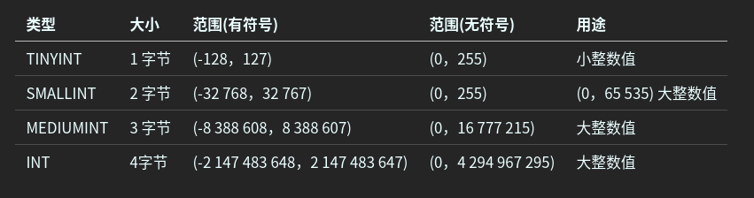
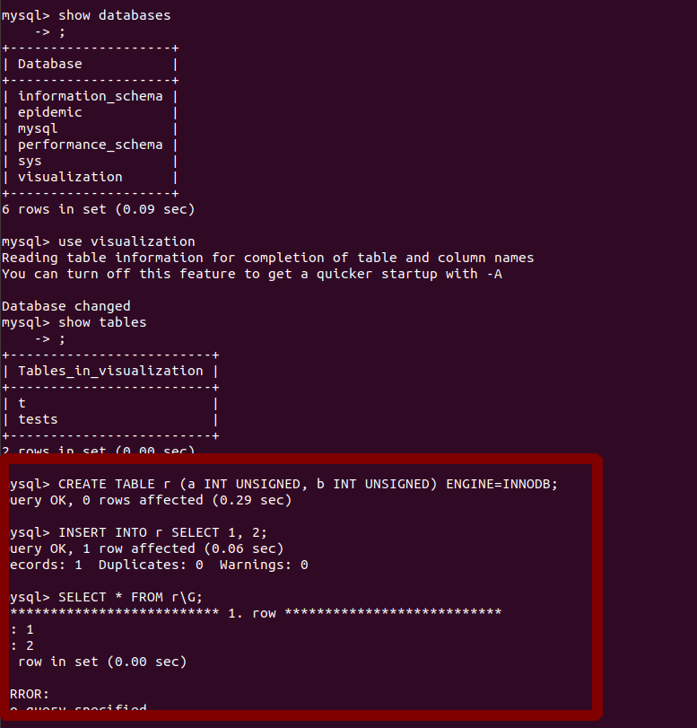
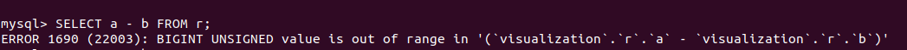
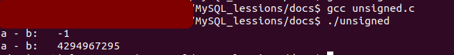
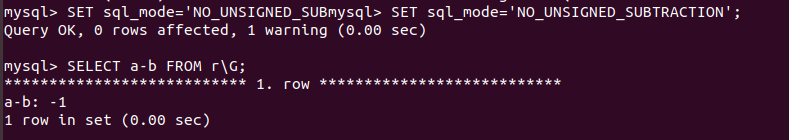

#! https://zhuanlan.zhihu.com/p/426230888
<!--
 * @Author: your name
 * @Date: 2021-10-26 21:35:30
 * @LastEditTime: 2021-10-27 10:48:44
 * @LastEditors: Please set LastEditors
 * @Description: In User Settings Edit
 * @FilePath: /MySQL_lessions/docs/MySQL数据类型: UNSIGNED.md
-->
# MySQL数据类型: UNSIGNED
# UNSIGNED 

UNSIGNED属性就是将数字类型无符号化，与C、C++这些程序语言中的unsigned含义相同。例如，INT的类型范围是-2 147 483 648 ～ 2 147 483 647， INT UNSIGNED的范围类型就是0 ～ 4 294 967 295。

在MYSQL中整型范围：

|类型   | 大小   |   范围(有符号)| 范围(无符号) | 用途 |
|---|---|---|---|---|
| TINYINT   |  1 字节 | (-128，127)    |   (0，255)  | 小整数值  |
|SMALLINT   |  2 字节 |  (-32 768，32 767)      |   (0，255)  |   (0，65 535) 大整数值  |
|MEDIUMINT     |  3 字节  |   (-8 388 608，8 388 607)       |    (0，16 777 215)   |   大整数值  |
|INT     |  4字节  |   (-2 147 483 648，2 147 483 647)      |    (0，4 294 967 295)  |   大整数值  |



源文档：http://blog.sina.com.cn/s/blog_46f224ea010008zp.html


看起来这是一个不错的属性选项，特别是对于主键是自增长的类型，`因为一般来说，用户都希望主键是非负数。然而在实际使用中，UNSIGNED可能会带来一些负面的影响`，示例如下：



我们创建了一个表r，存储引擎为InnoDB。表r上有两个UNSIGNED的INT类型。输入（1，2）这一行数据，目前看来都没有问题，接着运行如下语句：



发现会报错。

这个错误乍看起来非常奇怪，`提示BIGINT UNSIGNED超出了范围，但是我们采用的类型都是INT UNSIGNED啊！`

上面有提到`UNSIGNED属性就是将数字类型无符号化，与C、C++这些程序语言中的unsigned含义相同`, 我们来看看在c语言中会怎样

```

#include <stdio.h>
int main() {
    unsigned int a;
    unsigned int b;
    a = 1;
    b = 2;
    printf("a - b:   %d\n", a -b );
    printf("a - b:   %u\n", a -b );
    return 1;
}
```


可以看到，在C语言中a-b也可以返回一个非常巨大的整型数，这个值是INT UNSIGNED的最大值

将上面的C程序做一些修改：

```

#include <stdio.h>
int main() {
    unsigned int a;
    unsigned int b;
    a = 1;
    b = 2;
    printf("a - b:   %d, %x\n", a-b , a-b);
    printf("a - b:   %u, %x\n", a-b, a-b );
    return 1;
}
```


这次不仅打印出a-b的结果，也打印出a-b的十六进制结果

可以看到结果都是0xFFFFFFFF，只是0xFFFFFFFF可以代表两种值：对于无符号的整型值，其是整型数的最大值，即4294967295；对于有符号的整型数来说，第一位代表符号位，如果是1，表示是负数，这时应该是取反加1得到负数值，即-1。


这个问题的核心是，在MySQL数据库中，对于UNSIGNED数的操作，其返回值都是UNSIGNED的。而正负数这个问题在《MySQL技术内幕：InnoDB存储引擎》中有更深入的分析，感兴趣的同学可以看看

<b>那么，怎么获得-1这个值呢？</b>对SQL_MODE这个参数进行设置即可




# 结论

个人的看法是尽量不要使用UNSIGNED，因为可能会带来一些意想不到的效果。另外，对于INT类型可能存放不了的数据，INT UNSIGNED同样可能存放不了，与其如此，还不如在数据库设计阶段将INT类型提升为BIGINT类型


